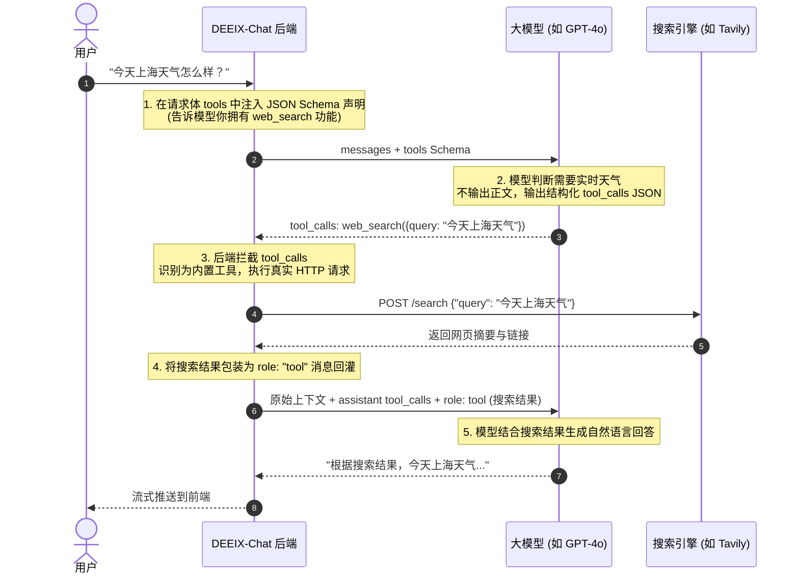

# DEEIX-Chat 模型联网功能 (Web Search) 架构调研与实现计划 (TODO)

本文档整理了对 `HaloWebUI` 联网实现机制的逆向分析、`DEEIX-Chat` 现有对话/工具管线现状，以及在 `DEEIX-Chat` 中落地通用联网搜索功能的完整技术方案与实施路径。

---

## 目录
1. [背景与需求](#1-背景与需求)
2. [HaloWebUI 联网机制深度剖析](#2-halowebui-联网机制深度剖析)
3. [DEEIX-Chat 现有对话与工具管线现状](#3-deeix-chat-现有对话与工具管线现状)
4. [核心概念澄清：Tool / Function Calling 的本质](#4-核心概念澄清tool--function-calling-的本质)
5. [模型兼容性分析与双保险策略](#5-模型兼容性分析与双保险策略)
6. [DEEIX-Chat 内置 Web Search 详细实施方案](#6-deeix-chat-内置-web-search-详细实施方案)
7. [待办任务清单 (Action Items)](#7-待办任务清单-action-items)

---

## 1. 背景与需求

在 AI 对话系统中，大模型本身无法主动访问互联网。为了让模型获取最新时效信息、查询外部知识库或事实核查，需要为其提供联网能力。
本项目旨在参考 `HaloWebUI` 的设计，在 `DEEIX-Chat` 中构建一套高可用、通用（对开源/商业模型友好）且低侵入的联网搜索功能。

---

## 2. HaloWebUI 联网机制深度剖析

HaloWebUI 采用了 **分层 + 双轨制** 的架构，支持以下 4 种模式：

### 2.1 四大运行模式
1. **`halo` (服务端 RAG 搜索 / Pre-Retrieval 模式)**
   - **特点**：不依赖模型本身的 Function Calling 能力。
   - **流程**：后端在调用 LLM 之前，先用 Task Model 生成搜索词 → 调用第三方搜索引擎（Tavily/SearXNG/Bing 等 19 种引擎）→ 抓取网页正文（SafeWeb/Playwright 等 4 种 Loader）→ 向量化或直接摘要 → 组装 `<source id="1">...</source>` 标签直接注入 System Prompt → 调用 LLM。
2. **`native` (厂商原生 Grounding / 上游托管搜索)**
   - **特点**：依赖 OpenAI Responses (`web_search_preview`)、Gemini Grounding (`googleSearch`)、Anthropic (`web_search`) 或 xAI Grok 的原生联网。
   - **流程**：请求中携带厂商专用工具声明，上游服务端执行搜索并随回答返回 Citations。
3. **`auto` (智能路由模式)**
   - **特点**：结合正则规则（否定词/明确搜索词）+ Task LLM 判定用户意图。
   - **策略**：优先走 `native` 路由；若模型不支持或报错，自动无缝降级到 `halo` 模式。
4. **`builtin_tools` (内置 Agent Function Calling 模式)**
   - **特点**：向支持 Function Calling 的模型注入 `search_web` 和 `fetch_url` 两个内置系统工具声明，模型在推理过程中可自主决定是否搜索、搜索什么、多次搜索并抓取网页。

---

## 3. DEEIX-Chat 现有对话与工具管线现状

### 3.1 优势与现状
- **厂商原生联网已支持**：`backend/internal/shared/nativetool/catalog.go` 已适配 OpenAI、Anthropic、Gemini、xAI 的原生 Web Search。
- **前端 UI 已适配**：`frontend/features/chat/components/message/message-tool-trace.tsx` 已经专门针对 `web_search`、`google_search` 实现了折叠卡片、查询词、来源 URL 列表及状态动画。只要后端输出 `web_search` 的 `ToolCall`，前端无需重构即可自动渲染！
- **多轮工具循环完善**：`backend/internal/application/conversation/service_message_send.go` 具备完善的 `for len(upstreamOutput.ToolCalls) > 0` 迭代循环，自带 Token 预算裁剪 (`enforceToolResultAggregateBudget`)、重复调用去重 Ledger 以及并发限制器。

### 3.2 现有痛点
- **缺少通用独立联网搜索**：当前除了厂商官方的原生联网和外部 MCP Server 外，后端没有内置的通用搜索引擎实现（如本地 Ollama 模型或开源 API 中转站无法使用自建搜索）。
- **工具执行入口存在 MCP 强校验**：当前 `service_tool.go` 的 `executeToolCall` 和 `service_tool_execution.go` 要求工具必须绑定 `MCPConfig`，否则会被判定为 `tool not enabled` 产生 Fatal 错误。

---

## 4. 核心概念澄清：Tool / Function Calling 的本质

大模型本身**不会真正去执行网络请求**，Function Calling 本质上是一套**通信协议**：



三要素构成：
1. **工具声明 (JSON Schema)**：后端通知模型可用能力的协议描述。
2. **模型决策 (Tool Call)**：模型输出结构化 JSON，表明调用意图与入参。
3. **真实执行 (Backend Handler)**：后端 Go 代码捕获该调用并请求搜索引擎 API，最后把结果回灌给模型。

---

## 5. 模型兼容性分析与双保险策略

### 5.1 模型支持度矩阵
- **商业旗舰 API (GPT-4o / Claude 3.5 / Gemini 2.0 / Grok)**：Function Calling 非常可靠，推荐走 **Tools 模式**（模型自主决定搜索词与时机）。
- **国产大模型 API (DeepSeek-V3 / Qwen 2.5)**：Function Calling 基本可靠，支持 Tools 模式。
- **开源小模型 / 本地 Ollama (7B/14B 等)**：Function Calling 易发生格式错误或无法触发，建议降级走 **Pre-Retrieval (Halo 模式)**。

### 5.2 双保险落地策略
```
用户开启联网搜索
    │
    ├── 模型支持 Function Calling?
    │     │
    │     ├── 是 ──► [方案 A: 内置 Tool 模式] (推荐首选)
    │     │          注入 web_search 工具声明，模型自主决定调用
    │     │
    │     └── 否 ──► [方案 C: Pre-Retrieval 模式] (降级兜底)
    │                后端在调用 LLM 前先调搜索引擎，将 <source> 标签拼入 Prompt
```

---

## 6. DEEIX-Chat 内置 Web Search 详细实施方案

### 6.1 架构改动点总览

```
[新建] backend/internal/infra/websearch/provider.go          # 搜索引擎统一接口
[新建] backend/internal/infra/websearch/tavily.go            # Tavily Search API 实现
[新建] backend/internal/application/conversation/
       service_builtin_tools.go                              # 内置工具定义与执行路由
[修改] backend/internal/application/conversation/
       service.go                                            # 注入 webSearchProvider
[修改] backend/internal/application/conversation/
       service_tool.go                                       # executeToolCall 增加内置工具分支
[修改] backend/internal/application/conversation/
       service_tool_execution.go                             # executeAssistantToolCalls 放行内置工具
[修改] backend/internal/application/conversation/
       service_mcp_tools.go                                  # resolveSelectedToolRuntime 注入工具定义
[修改] backend/internal/infra/config/config.go               # 增加 WebSearch 配置项
[修改] config.yaml                                           # 增加配置参数
```

### 6.2 关键代码实现骨架

#### 1. 统一接口与 Tavily Provider (`infra/websearch`)
```go
// backend/internal/infra/websearch/provider.go
package websearch

import "context"

type SearchResult struct {
    Title   string `json:"title"`
    URL     string `json:"url"`
    Snippet string `json:"snippet"`
}

type SearchResponse struct {
    Query   string         `json:"query"`
    Results []SearchResult `json:"results"`
}

type Provider interface {
    Search(ctx context.Context, query string, count int) (*SearchResponse, error)
    Name() string
}
```

```go
// backend/internal/infra/websearch/tavily.go
package websearch

import (
    "bytes"
    "context"
    "encoding/json"
    "fmt"
    "io"
    "net/http"
    "strings"
    "time"
)

type TavilyProvider struct {
    apiKey  string
    baseURL string
    client  *http.Client
}

func NewTavilyProvider(apiKey, baseURL string) *TavilyProvider {
    base := strings.TrimRight(strings.TrimSpace(baseURL), "/")
    if base == "" {
        base = "https://api.tavily.com"
    }
    return &TavilyProvider{
        apiKey:  strings.TrimSpace(apiKey),
        baseURL: base,
        client:  &http.Client{Timeout: 30 * time.Second},
    }
}

func (p *TavilyProvider) Name() string { return "tavily" }

func (p *TavilyProvider) Search(ctx context.Context, query string, count int) (*SearchResponse, error) {
    if count <= 0 { count = 5 }
    reqBody, _ := json.Marshal(map[string]interface{}{
        "query": query, "api_key": p.apiKey, "max_results": count,
    })
    req, err := http.NewRequestWithContext(ctx, http.MethodPost, p.baseURL+"/search", bytes.NewReader(reqBody))
    if err != nil { return nil, err }
    req.Header.Set("Content-Type", "application/json")

    resp, err := p.client.Do(req)
    if err != nil { return nil, err }
    defer resp.Body.Close()

    body, _ := io.ReadAll(resp.Body)
    if resp.StatusCode != http.StatusOK {
        return nil, fmt.Errorf("tavily error (status %d): %s", resp.StatusCode, string(body))
    }

    var tavilyResp struct {
        Results []struct {
            URL     string `json:"url"`
            Title   string `json:"title"`
            Content string `json:"content"`
        } `json:"results"`
    }
    if err := json.Unmarshal(body, &tavilyResp); err != nil { return nil, err }

    results := make([]SearchResult, 0, len(tavilyResp.Results))
    for _, r := range tavilyResp.Results {
        results = append(results, SearchResult{
            Title: r.Title, URL: r.URL, Snippet: r.Content,
        })
    }
    return &SearchResponse{Query: query, Results: results}, nil
}
```

#### 2. 内置工具注册与执行 (`service_builtin_tools.go`)
```go
package conversation

import (
    "context"
    "encoding/json"
    "fmt"
    "strings"
    "github.com/DEEIX-AI/DEEIX-Chat/backend/internal/infra/llm"
)

const (
    builtinToolPrefix        = "__builtin__:"
    builtinWebSearchToolName = "web_search"
)

func webSearchToolDefinition() llm.ToolDefinition {
    return llm.ToolDefinition{
        Name:        builtinWebSearchToolName,
        Description: "Search the web for current information. Use this when you need up-to-date facts, news, or real-time data.",
        InputSchema: json.RawMessage(`{
            "type": "object",
            "properties": {
                "query": {
                    "type": "string",
                    "description": "The search query to look up on the web."
                }
            },
            "required": ["query"]
        }`),
    }
}

func isBuiltinTool(toolName string) bool {
    return strings.HasPrefix(toolName, builtinToolPrefix)
}

func builtinToolActualName(toolName string) string {
    return strings.TrimPrefix(toolName, builtinToolPrefix)
}

func (s *Service) executeBuiltinWebSearch(ctx context.Context, argumentsJSON string) (string, error) {
    if s.webSearchProvider == nil {
        return "", fmt.Errorf("web search provider is not configured")
    }
    var args struct { Query string `json:"query"` }
    if err := json.Unmarshal([]byte(argumentsJSON), &args); err != nil {
        return "", fmt.Errorf("invalid web_search arguments: %w", err)
    }
    query := strings.TrimSpace(args.Query)
    if query == "" { return "[]", nil }

    resp, err := s.webSearchProvider.Search(ctx, query, 5)
    if err != nil { return "", err }

    resultJSON, err := json.Marshal(resp.Results)
    if err != nil { return "", err }
    return string(resultJSON), nil
}
```

#### 3. 绕过 MCP 限制与执行分发 (`service_tool.go` & `service_tool_execution.go`)
- **在 `service_tool.go` 的 `executeToolCall` 中**：
  ```go
  if isBuiltinTool(toolName) {
      return s.executeBuiltinTool(ctx, toolName, input.ArgumentsJSON)
  }
  // 原有 MCPConfig nil 校验保留在下方
  ```
- **在 `service_tool_execution.go` 的 `executeAssistantToolCalls` 中**：
  ```go
  executionToolName := resolveExecutionToolName(modelToolName, input.ToolNameMap)
  if isBuiltinTool(executionToolName) {
      // 跳过 mcpConfig == nil 的 fatal error 检查，直接调用 executeToolCall 并组装结果 slot
  }
  ```
- **在 `service_mcp_tools.go` 的 `resolveSelectedToolRuntime` 中**：
  ```go
  if s.webSearchProvider != nil && s.cfg.Snapshot().WebSearchEnabled {
      builtinDef := webSearchToolDefinition()
      result.definitions = append(result.definitions, builtinDef)
      result.nameMap[builtinWebSearchToolName] = builtinToolPrefix + builtinWebSearchToolName
      result.schemas[builtinWebSearchToolName] = builtinDef.InputSchema
  }
  ```

---

## 7. 待办任务清单 (Action Items)

### 阶段一：基础 Function Calling 联网功能 (MVP)
- [ ] **1.1 搜索 Provider 模块构建**
  - [ ] 新建 `backend/internal/infra/websearch/provider.go`
  - [ ] 新建 `backend/internal/infra/websearch/tavily.go`
  - [ ] 编写 Tavily 单元测试验证 API 调用与解析
- [ ] **1.2 内置工具注册与执行路由**
  - [ ] 新建 `backend/internal/application/conversation/service_builtin_tools.go`
  - [ ] 修改 `backend/internal/application/conversation/service.go` 引入 `webSearchProvider`
  - [ ] 修改 `backend/internal/application/conversation/service_tool.go` 增加内置工具分发
  - [ ] 修改 `backend/internal/application/conversation/service_tool_execution.go` 放行内置工具
  - [ ] 修改 `backend/internal/application/conversation/service_mcp_tools.go` 注入工具声明与名称映射
- [ ] **1.3 配置集成**
  - [ ] 修改 `backend/internal/infra/config/config.go` 增加 WebSearch 相关字段
  - [ ] 在 `config.yaml` / `config.example.yaml` 中增加配置样例 (API Key, Base URL, Enable 开关)
- [ ] **1.4 联调与测试**
  - [ ] 后端单测：验证 Tool Schema 组装、Tool Call 拦截与结果回灌
  - [ ] 前端验证：观察 `message-tool-trace.tsx` 是否正常呈现搜索折叠卡片与 URL 来源

### 阶段二：增强与进阶能力 (后续扩展)
- [ ] **2.1 多搜索引擎适配**
  - [ ] 支持 SearXNG (自建开源无限制)
  - [ ] 支持 Bing Web Search API / Google Custom Search
  - [ ] 支持 DuckDuckGo (免费兜底)
- [ ] **2.2 网页正文抓取工具 (`fetch_url`)**
  - [ ] 注册内置 `fetch_url` 工具，让模型在搜索后可针对特定 URL 提取完整正文
- [ ] **2.3 Pre-Retrieval 兜底支持 (针对弱小模型)**
  - [ ] 在模型不支持 Function Calling 时，提供前置检索注入 Prompt 的降级通道
- [ ] **2.4 前端体验优化**
  - [ ] 在输入框/模型设置中提供联网搜索全局开关或单次开关
